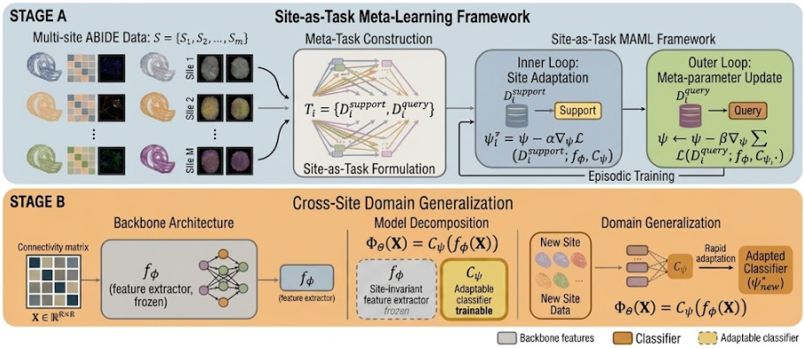
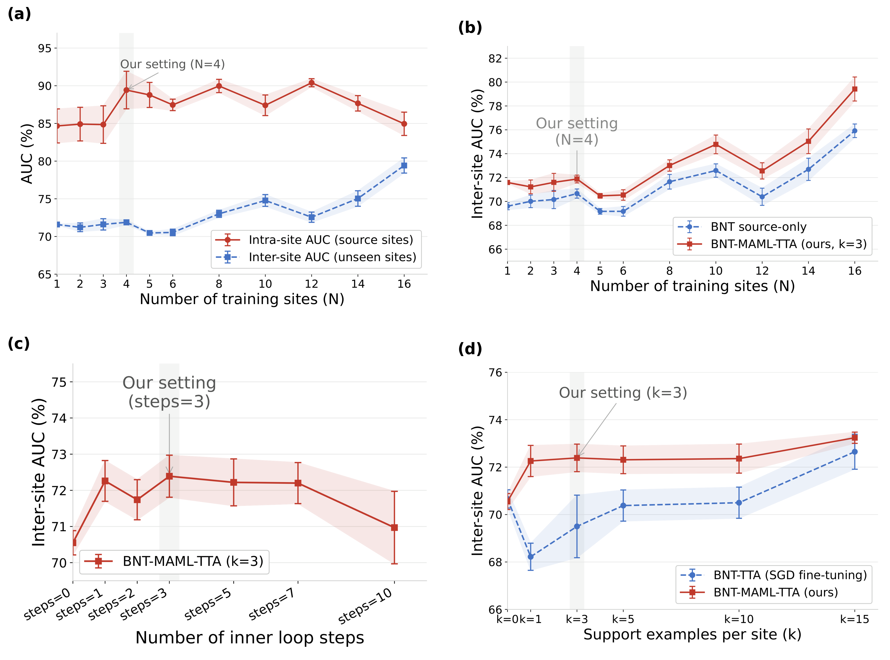

# Few-Shot Cross-Site Domain Generalization for Multi-Site Autism Brain Network Classification

This is the official implementation of the paper **"Few-Shot Cross-Site Domain Generalization for Multi-Site Autism Brain Network Classification"**, submitted to MICCAI 2026 MLMI Workshop.

## Overview



We propose a site-adaptive meta-learning framework that combines Model-Agnostic Meta-Learning (MAML) with Test-Time Adaptation (TTA) for multi-site brain network classification. By treating each acquisition site as a distinct meta-learning task, our framework meta-trains a linear classifier on top of a frozen pre-trained backbone, learning an initialization that rapidly adapts to unseen sites at test time using only k=3 support examples.



## Dataset

Download the ABIDE I dataset from [here](https://drive.google.com/file/d/14UGsikYH_SQ-d_GvY2Um2oEHw3WNxDY3/view?usp=sharing) (provided by the [BNT repository](https://github.com/Wayfear/BrainNetworkTransformer)).

After downloading, update the dataset path in the training scripts:
```python
data = np.load('/path/to/your/abide.npy', allow_pickle=True).item()
```

## Installation

```bash
conda create --name maml_tta python=3.9
conda install pytorch torchvision torchaudio cudatoolkit=11.3 -c pytorch
conda install -c conda-forge scikit-learn
pip install omegaconf wandb
```

## Usage

### 1. Train BNT backbone (source-only, required before MAML)
```bash
sbatch scripts/train_bnt_source_only.sh
```

### 2. Train our method (BNT-MAML-TTA)
```bash
sbatch scripts/train_bnt_maml_tta.sh
```

### 3. Run baselines
```bash
sbatch scripts/train_bnt_coral.sh
sbatch scripts/train_bnt_mldg.sh
```

### 4. Run ablation study
```bash
sbatch scripts/train_bnt_tta_no_maml.sh
sbatch scripts/train_bnt_maml_no_tta.sh
```

### 5. Run scaling experiments
```bash
sbatch scripts/train_maml_scaling.sh
```

### 6. Generate figures
```bash
python generate_figures/generate_data_efficiency.py
python generate_figures/generate_scaling.py
python generate_figures/generate_auc_steps.py
python generate_figures/generate_intra_inter_scaling.py
```

## Results

Inter-site results on ABIDE I (mean ± std over 5 seeds):

| Method | AUC (%) | ACC (%) | SEN (%) | SPEC (%) |
|--------|---------|---------|---------|----------|
| MLP | 67.60 ± 0.60 | 62.50 ± 1.44 | 73.36 ± 14.52 | 50.50 ± 16.62 |
| GraphTransformer | 66.14 ± 0.62 | 61.74 ± 0.86 | 64.63 ± 5.35 | 58.56 ± 4.73 |
| BNT | 70.66 ± 0.86 | 65.47 ± 1.18 | 71.79 ± 3.92 | 58.49 ± 4.05 |
| BNT-CORAL | 70.12 ± 0.23 | 65.03 ± 1.26 | 70.94 ± 3.69 | 58.49 ± 5.16 |
| BNT-MLDG | 70.11 ± 1.19 | 64.65 ± 2.66 | 77.92 ± 8.40 | 50.00 ± 13.97 |
| BNT-TTA (w/o MAML) | 69.47 ± 1.76 | 64.63 ± 1.88 | 69.01 ± 4.39 | 59.85 ± 3.46 |
| BNT-MAML (w/o TTA) | 70.55 ± 0.75 | 63.35 ± 3.15 | 71.79 ± 3.92 | 58.49 ± 4.05 |
| MLP-MAML-TTA | 69.05 ± 1.20 | 63.02 ± 1.80 | 69.20 ± 12.37 | 56.30 ± 10.79 |
| GraphTransformer-MAML-TTA | 67.68 ± 0.83 | 61.29 ± 2.89 | 77.00 ± 12.40 | 44.24 ± 18.53 |
| **BNT-MAML-TTA (ours)** | **72.39 ± 1.30** | **66.75 ± 2.22** | **75.31 ± 5.14** | 57.39 ± 7.96 |

## Dependencies

- python=3.9
- pytorch=1.12.1
- cudatoolkit=11.3
- scikit-learn=1.1.1
- omegaconf=2.2.3
- wandb=0.13.1

## Acknowledgements

Our backbone implementation is based on [Brain Network Transformer](https://github.com/Wayfear/BrainNetworkTransformer).

## Citation

If you find this code useful for your work, please cite our paper:

```bibtex
@article{fewshot2026maml,
  title={Few-Shot Cross-Site Domain Generalization for 
         Multi-Site Autism Brain Network Classification},
  journal={MICCAI MLMI Workshop},
  year={2026},
  note={Paper under review}
}
```